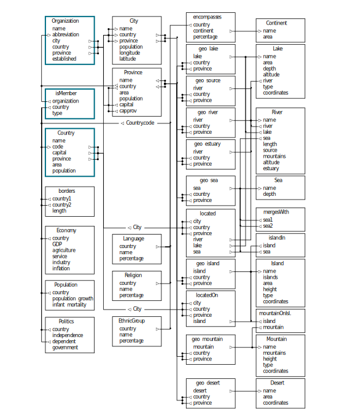

```{r setup, include=FALSE}

library(tidyverse)
library(data.table)
library(knitr)
library(kableExtra)
library(knitcitations)
library(bibtex)

```

<div class="activity">
COLLECTIONS  
</div>

# Data Models
## What are they?

> How many piano tuners are there in Chicago?\
-- Enrico Fermi\

The objective of this section is to provide an overview of the key concepts of systems thinking and model building as they relate to the visual analytics process. Defining focal questions, developing a system model, understanding system behaviors and identifying potential leverage points are among the tasks which lead to developing an information model which is used for the basis of analysis.

# Overview
## Questions, systems, leverage points, and models

***

The classic Fermi problemX of piano tuners in Chicago typifies, albeit on a small scale, the challenges faced by analysts when studying real world issues which involve making educated guesses about subjects that seem impossible to measure with limited information. Moving from Chicago to international concerns, the task of answering questions about the world and its systems of economy, politics, education, the environment and health magnify this challenge to a global scale. Let us assume instead the question is how many people in Somalia are affected by HIV/AIDS or illiteracy. Or more importantly, what can we do about such problems? Take for example the agenda of the Millennium Development Goals which underscores a vast scope and scale:

The eight Millennium Development Goals (MDGs) – which range from halving extreme poverty to halting the spread of HIV/AIDS and providing universal primary education, all by the target date of 2015 – form a blueprint agreed to by all the world’s countries and all the world’s leading development institutions

Carrying the slogan Make it happen - End Poverty by 2015, the importance of tackling the MDG initiative with sound analysis and effective policy decision can not be overstated. Considering the impact policy decisions may have on matters of poverty or health, issues of this profound and complex nature require a structured and systematic approach to understanding the challenge.

This approach of structuring a problem for analysis is described as the Creating Models activity. The purpose of this activity is to provide the methodology for defining, describing, and subsequently analyzing issues for sense making and decision taking. Creating models is based on four tasks:

* Developing a Model
* Diagraming a Model

This section describes these tasks and patterns for creating models beginning with the first important step, defining the focal questions.

# Developing a Model

***

As we turn from systems thinking, let’s think back to our early school days of building a project for a science fair. Remember that erupting volcano you built with paper maché and baking soda? This is an example of a model - a simplification of reality intended to promote understanding. Model design involves the construction of a model from observations provided by systems thinking:

> Our knowledge and assumptions about the components of a system, even systems as complex as our social systems, can now be interrelated and examined through methods that have been developed in the last several decades. Such is done by organizing the individual concepts into a “model” that reveals the consequences and internal inconsistencies of our assumptions and fragments of knowledge.\
-- Forrester, 1

The model design process aims to create a structure of the system as the basis for analysis. A model is a simplified representation of your view of a situation, constructed to assist in working with that situation in a systemic manner. A model is a logical representation of a system as a simplified abstract view of a complex reality. The purpose of a model is to be able to answer questions in place of the system, in the same way the system itself would have answered similar questions:

> “Modeling in the broadest sense is the cost-effective use of something in place of something else for some cognitive purpose. It allows us to use something that is simpler, safer or cheaper than reality instead of reality for some purpose. A model represents reality for the given purpose; the model is an abstraction of reality in the sense that it cannot represent all aspects of reality. This allows us to deal with the world in a simplified manner, avoiding the complexity, danger and irreversibility of reality.”\
-- Rothenberg, 1989

Modelling is used to support describing and predicting system behavior; likewise it enables us to evaluate the outcome of an intervention and the leverage points described earlier.

# Modelling Approach

***

The modelling process involves defining the system, its objects, characteristics, and behaviors. When designing a system model, you must focus on defining its basic components which are comprised of five things: 

* objects — the parts, 
* elements, or variables within the system; 
* attributes — the qualities or properties of the system and its objects; 
* relationships — the linkages among objects; 
* border — the bounded scope of the system; and, 
* environment — a set of things that affect one another within an environment.

Thinking in terms of objects, attributes, and relationships will serve dividends throughout the Models of Information Activity as we will revisit this in Chapter 4 when discussing Populating Models. For now we’ll use these concepts as the building blocks. The following four steps cover the basic process for creating a model.

* Identify the system of interest, in particular specify the system boundary and specify the level of detail in which you are interested; this usually involves specifying what are to be considered sub-systems or elements within the overall system.
* Identify the main features and behaviors of the system of interest
* Select a modelling technique that will address the features / behavior of the specified system in a way that matches the specified purpose.
* Develop a full version of the model by a process of iteration, expansion and inclusion of detailed data as required.

While following these steps there are a number of considerations that must be taken into account such as the time horizon, boundaries, levels of aggregation, and delays. In the next section we’ll see how to describe and express a model using specialized diagramming approaches.

{height=1000}

# Exercises and practice
## Knime and R practice solutions


# References
## The citations and data sources used for this case

1. Senge, Peter M. (1990), The Fifth Discipline, Doubleday/Currency,
2. Ludwig von Bertalanffy (1976 - revised) General System theory: Foundations, Development, Applications.
3. Ackoff, R. Towards A System of Systems Concepts. Originally published in Management Science, Vol. 17, No. 11, July 1971
4. Systems thinking and practice, The Open University. http://openlearn.open.ac.uk/mod/resource/view.php?id=183686
5. Matthias Ruth, Bruce M. Hannon, Jay W. Forrester, Modeling dynamic economic systems
6. Meadows, D. (2008, December). Thinking in Systems: A Primer. Chelsea Green Publishing.
7. Rothenberg, J. The Nature of Modeling. Chapter for “AI, Simulation & Modeling”
8. Lawrence E. Widman, Kenneth A. Loparo, and Norman R. Nielsen, editors. John Wiley & Sons, Inc., August 1989, pp. 75−92. (Reprinted as N−3027−DARPA, The RAND Corporation, November 1989.)
9. Newman, J. H. (1999, September). The Idea of a University. Gateway Editions. Page 122.
10. Choucri, Nazli, Goldsmith, Daniel, Madnick, Stuart E., Mistree, Dinsha, Morrison, J. Bradley and Siegel, Michael, Using System Dynamics to Model and Better Understand State Stability (July 1, 2007). MIT Sloan Research Paper No. 4661-07. Available at SSRN: http://ssrn.com/abstract=1011230
11. W. May. Information extraction and integration with FLORID: The MONDIAL case study. Technical report, Universit¨at Freiburg, Institut fur Informatik, 1999. http://dbis.informatik.uni-goettingen.de/Mondial
12. Sweeney, Linda, and John Sterman. “Bathtub dynamics: initial results of a systems thinking inventory.” System Dynamics Review 16 (2000): 249-286.
13. National Geographic. The Big Idea: The Carbon Bathtub. December 2009. http://ngm.nationalgeographic.com/bigidea/05/carbon-bath
14. Sterman, John, and Linda Sweeney. “Cloudy skies: assessing public understanding of global warming.” System Dynamics Review 18 (2002): 207-240.
15. J. D. Sterman and L. Booth Sweeney (2007) Understanding Public Complacency About Climate Change: Adults’ mental models of climate change violate conservation of matter. Climatic Change, 80, 213-238.
16. Forrester, Jay Wright. World dynamics . Cambridge, Mass.: Wright-Allen Press, 1971.
17. Pink, Daniel H.. A whole new mind: why right-brainers will rule the future. New York: Riverhead Books, 2006.

```{r generateBibliography, echo=FALSE, message=FALSE, warning=FALSE}

#cleanbib()
#options("citation_format" = "pandoc")
#read.bibtex(file = "../archetypes/average-working-hours-of-children.bib")

```


```{r, message=FALSE, warning=FALSE, echo=FALSE}

# echo=FALSE will exclude block from code folding
# Example for including external html content when needed
htmltools::includeHTML("mark-complete-button.html")

```


```{r, child='mark-complete-click.Rmd'}

```


```{js, message=FALSE, warning=FALSE, echo=FALSE}

// Must be included to position footer
$(function() {
  $('.main-container').after($('.footer'));
})

```

