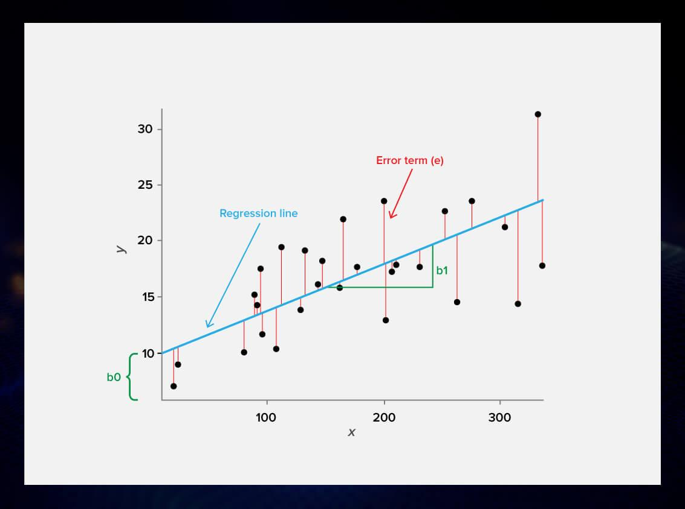

```{r, include=FALSE}

knitr::opts_chunk$set(message=FALSE, warning=FALSE, echo = FALSE,
   dev = "svg")
options(scipen = 999) ## To disable scientific notation

library(tidyverse)
library(ggplot2)
library(dplyr)
library(stringr)
library(lubridate)
library(DT)
library(caret)
library(leaflet)
library(corrplot)
library(boot)
library(knitcitations)
library(bibtex)
library(ggiraph)
library(base)
library(xgboost)
```


<div class="activity">
Qualitative Analysis and Machine Learning
</div>


# Linear Regression
## Manhattan Rent by StreetEasy

#### Linear regression is a linear model, e.g. a model that assumes a linear relationship between the input variables (x) and the single output variable (y). More specifically, that y can be calculated from a linear combination of the input variables (x).



#### The regression line thus encompass the formula y= (b1 * x) + b0. In our case, it would be Rent = (b1 * Features) + b0. Our task is to find the b1 and b0. 

#### One of the most popular methodology of linear regression is Ordinary Least Squares. The Ordinary Least Squares procedure seeks to minimize the sum of the squared residuals. This means that given a regression line through the data we calculate the distance from each data point to the regression line, square it, and sum all of the squared errors together.

***

# Load and Wrangle data [Ingest].

## The 7 Steps of Machine Learning

1 - Data Collection. 

2 - Data Preparation.

3 - Choose a Model.

4 - Train the Model.

5 - Evaluate the Model.

6 - Parameter Tuning.

7 - Make Predictions.


```{r, message=FALSE, warning=FALSE, echo=TRUE, class.source = 'fold-hide'}

# Load csv data file
df = read.csv("archetypes/manhattan.csv", header = TRUE, stringsAsFactors = FALSE)

df2 <- df %>%
  group_by(neighborhood) %>%
  summarise(PriceMedian = median(rent))  %>%
  arrange(desc(PriceMedian))


df<- merge(df, df2)
colnames(df)[19] <- "Neighborhood_price"

df <- df %>% select(-neighborhood, -rental_id, -borough)
head(df)

```


#### Onwards to Linear Regression Training. We will select "rent" as our target label and we'll be firstly utilizing all available features. You'll notice the different parameters in our first model. For example, "cv" stands for cross-validation, which is used to protect against overfitting in a predictive model. We'll be cross validating 5 times to find the model with optimal RMSE (Root Mean Squared Error). Lower RMSE means a better fit. The higher the R-squared, the better a model fits. 


```{r, message=FALSE, warning=FALSE, echo=TRUE, class.source = 'fold-hide'}

library(caret)

formula = rent ~ .

fitControl <- trainControl(method="cv",number = 5)

lrmodel = train(formula, data = df,
                   method = "lm",trControl = fitControl,metric="RMSE")


importance = varImp(lrmodel)

summary(lrmodel)
lrmodel


PlotImportance = function(importance)
{
  varImportance <- data.frame(Variables = row.names(importance[[1]]), 
                              Importance = round(importance[[1]]$Overall,2))
  
  # Create a rank variable based on importance
  rankImportance <- varImportance %>%
    mutate(Rank = paste0('#',dense_rank(desc(Importance))))
  
  rankImportancefull = rankImportance
  
  ggplot(rankImportance, aes(x = reorder(Variables, Importance), 
                             y = Importance)) +
    geom_bar(stat='identity',colour="white", fill = "#2185DC") +
    geom_text(aes(x = Variables, y = 1, label = Rank),
              hjust=0, vjust=.5, size = 4, colour = 'black',
              fontface = 'bold') +
    labs(x = 'Variables', title = 'Relative Variable Importance') +
    coord_flip() + 
    theme_bw()
  
  
}

PlotImportance(importance)


```


#### We will try another linear model: Generalized Linear Regression Model

```{r, message=FALSE, warning=FALSE, echo=TRUE, class.source = 'fold-hide'}


formula = rent ~ .

fitControl <- trainControl(method="cv",number = 5)

rlrmodel = train(formula, data = df,
                   method = "glmnet",trControl = fitControl,metric="RMSE")

importance2 = varImp(rlrmodel)

PlotImportance(importance2)

rlrmodel

```

#### We'll now introduce XGBoost to the regression models. XGBoost stands for eXtreme Gradient Boosting. XGBoost is a decision-tree-based ensemble Machine Learning algorithm that uses a gradient boosting framework. Here, the parameters are more pronounced and we can operate some Parameter-Tuning by tweaking some of these numbers.

```{r, message=FALSE, warning=FALSE, echo=TRUE, class.source = 'fold-hide'}

xgbGrid <- expand.grid(nrounds = 500,
                       max_depth = 4,
                      eta = .05,
                       gamma = 0,
                       colsample_bytree = .5,
                       min_child_weight = 1,
                       subsample = 1)

set.seed(13)

xgbmodel = train(formula, data = df,
                   method = "xgbTree",trControl = fitControl,
                   tuneGrid = xgbGrid,na.action = na.pass,metric="RMSE")

importance3 = varImp(xgbmodel)

PlotImportance(importance3)

xgbmodel
```


#### We'll make predictions with the regression model. 


```{r, message=FALSE, warning=FALSE, echo=TRUE, class.source = 'fold-hide'}

predict_rent <- df

predict_rent$pred <- predict(xgbmodel, df)

comparison <- predict_rent %>% select(rent, pred)
head(comparison, 10)

cor(predict_rent$pred, predict_rent$rent)
```


#### Let's Plot the Regression Line through our Actual Rent Price and Our predicted Price. 


```{r, message=FALSE, warning=FALSE, echo=TRUE, class.source = 'fold-hide', fig.width=8, fig.height=8, fig.align='center'}

v1<-ggplot(predict_rent, aes(x=pred,y=rent))+
  geom_point(color = "blue")+
  
  stat_smooth(aes(x=pred,y=rent),method="lm", color="red")+
  theme_bw()+
  theme(axis.title = element_text(size=16),axis.text = element_text(size=14))+
  xlab("Predicted Rent")+
  ylab("Actual Rent")

girafe(ggobj = v1, width_svg = 13, height_svg = 7,
       options = list(opts_sizing(rescale = TRUE, width = 1.0)))
```


#### Sometimes it might not be convienient or efficient to use all the variables available for training the model. It could make the model very heavy and slow. We could possibly be overfitting the model. And sometimes in real life, all the input variables might not be readily available.

#### Thus from our graph above, we will chose the most Import variables and train the model again. 


```{r, message=FALSE, warning=FALSE, echo=TRUE, class.source = 'fold-hide'}


df3 <- df %>% select(rent, size_sqft, bathrooms, bedrooms, Neighborhood_price, floor)

set.seed(13)

xgbmodel2 = train(formula, data = df3,
                   method = "xgbTree",trControl = fitControl,
                   tuneGrid = xgbGrid,na.action = na.pass,metric="RMSE")


df3$pred <- predict(xgbmodel2, df3)

comparison <- predict_rent %>% select(rent, pred)
head(comparison, 10)

cor(df3$pred, df3$rent)


predict(xgbmodel2,  data.frame(size_sqft = 663 , bathrooms = 1, bedrooms = 1, Neighborhood_price = 3782, floor = 12))


```

### What else can we do to improve accuracy.

1. Remove Outliers before feeding it to the model
2. Normalized/Standardized the data. Using library(scales), using min-max standardization. Using z-score standardization.
3. Train-Test split the data, like we would do traditionally.


```{r, message=FALSE, warning=FALSE, echo=FALSE}

# These lines of code is just to shaowcase what we'd normally do: split the data into Training and Teseting datsets. Our accuracy here runs around 93-95%.

#index = createDataPartition(df$rent, p = 0.90, list = FALSE)
#train = df[index, ]
#test = df[-index, ]


#set.seed(13)

#xgbmodel3 = train(formula, data = train, method = "xgbTree",trControl = fitControl, tuneGrid = xgbGrid,na.action = na.pass,metric="RMSE")


#test$pred <- predict(xgbmodel3, test)

#comparison <- test %>% select(rent, pred)
#head(comparison, 10)

#cor(test$pred, test$rent)


```


```{r, message=FALSE, warning=FALSE, echo=FALSE}

# Outliers Deleted Version

###
# library(ggstatsplot)
# 
# Q <- quantile(df$rent, probs=c(.25, .75), na.rm = FALSE)
# iqr <- IQR(df$rent)
# eliminated<- subset(df, df$rent > (Q[1] - 1.5*iqr) & df$rent < (Q[2]+1.5*iqr))
# 
# set.seed(13)
# 
# xgbmodel4 = train(formula, data = eliminated, method = "xgbTree",trControl = fitControl, tuneGrid = xgbGrid,na.action = na.pass,metric="RMSE")
# 
# 
# eliminated$pred <- predict(xgbmodel4, eliminated)
# 
# comparison <- eliminated %>% select(rent, pred)
# head(comparison, 10)
# 
# cor(eliminated$pred, eliminated$rent)

###
```


```{r, message=FALSE, warning=FALSE, echo=FALSE}

# Scaled Version

# library(ggstatsplot)
# 
# 
# eliminated<- as.data.frame(scale(eliminated))
# 
# set.seed(13)
# 
# xgbmodel5 = train(formula, data = eliminated, method = "xgbTree",trControl = fitControl, tuneGrid = xgbGrid,na.action = na.pass,metric="RMSE")
# 
# 
# eliminated$pred <- predict(xgbmodel5, eliminated)
# 
# comparison <- eliminated %>% select(rent, pred)
# head(comparison, 10)
# 
# cor(eliminated$pred, eliminated$rent)


```
